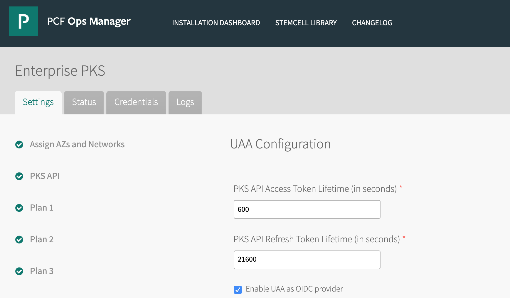
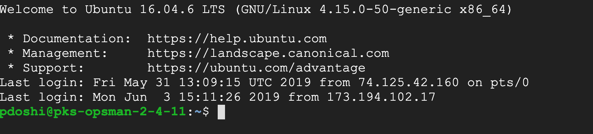
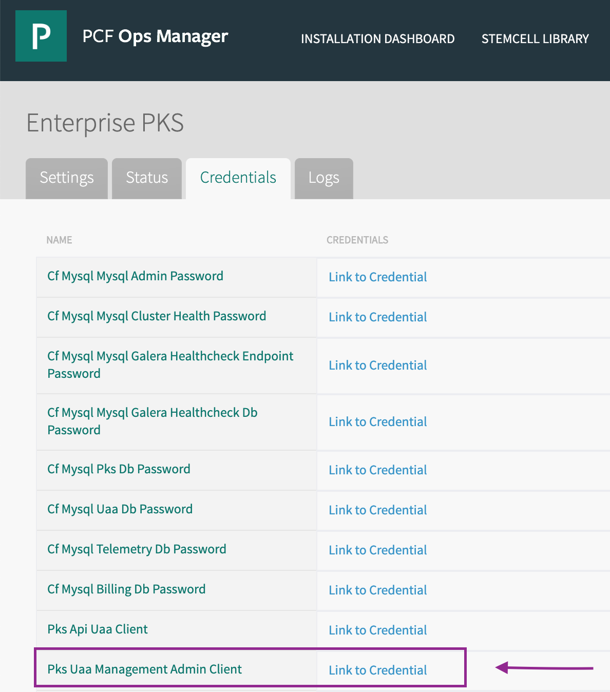

= Lab 0 - OIDC-UAA Integration, Accessing PKS environment, Using PKS CLI, Cluster Creation

Ensure that UAA is enabled as an OIDC provider in Ops Manager -> Enterprise PKS tile. See screenshot below.

  

This lab is configured to use UAA as the identity provider. This can also work with using LDAP as the identity provider. Follow these steps to create UAA users and map it to PKS group so that we can allow users to perform the role of PKS cluster admin or PKS cluster manager.

== Log in as UAA admin

. SSH into your PKS Ops Manager VM. This lab is conducted with PKS running on GCP. You should see a screen similar to the one below:
+
  

. Target your PKS UAA API endpoint with the following command. Replace the api endpoint with your PKS installation's PKS API endpoint.  On successful login, you will see the Target and Context as shown below:
+
----
uaac target https://api.pks.pcf4labs.com:8443 --ca-cert /var/tempest/workspaces/default/root_ca_certificate

Target: https://api.pks.pcf4labs.com:8443
Context: admin, from client admin
----

. Now, we will get an access token for the 'admin' user so that we can create custom UAA groups and UAA users (cluster admin, cluster managers and developers). You will need the 'admin' client secret for retrieving the access token. You can find the client secret in Ops Manager -> Enterprise PKS -> Credentials -> Pks Uaa Management Admin Client. (See screenshot below).
+

. Run the following command to get the access token, replace the XXX with your client secret retrieved in above step. You should see the message 'Successfully fetched token via client credentials grant.' if the command runs without errors.
+
----
uaac token client get admin -s XXX

Successfully fetched token via client credentials grant.
Target: https://api.pks.pcf4labs.com:8443
Context: admin, from client admin
----

== Create custom UAA users

. Run the below command to create the two custom users that will have PKS cluster admin and PKS cluster manager user role. You should see a success message after user account is created.

Create Cluster Admin user:
----
uaac user add pksclusteradmin --emails pksclusteradmin@example.com  -p password

user account successfully added
----

Create Cluster Manage user:
----
**uaac user add pksclustermanager --emails pksclustermanager@example.com  -p password**

user account successfully added
----

