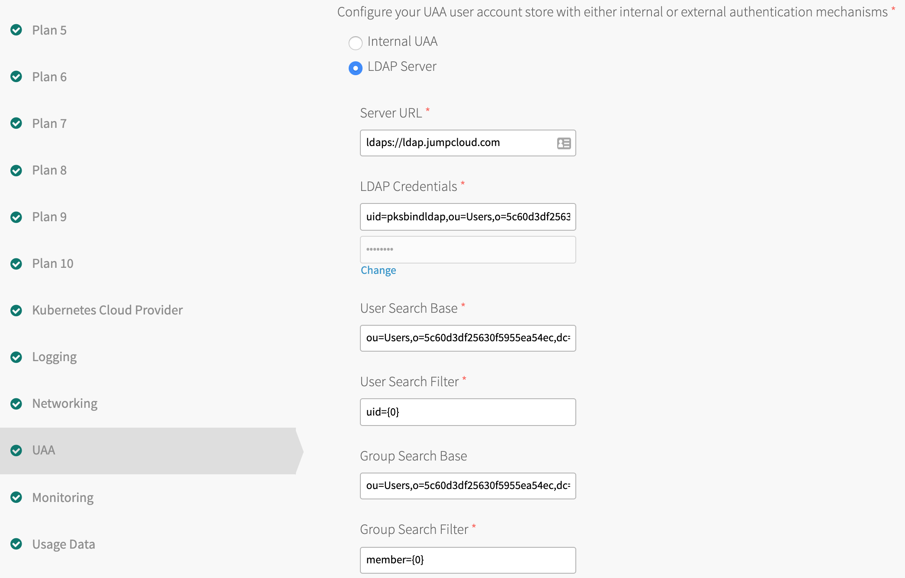

= Lab 0 - OIDC-UAA Integration, Accessing PKS environment, Using PKS CLI, Cluster Creation

Ensure that UAA is enabled as an OIDC provider in Ops Manager -> Enterprise PKS tile. See screenshot below.

image::../common/images/enable_uaa_oidc_provider.png[]  

This lab is configured to work with setting up LDAP as the identity provider. This will allow mapping LDAP groups to UAA. Below is an example of LDAP configuration done in Ops Manager -> Enterprise PKS tile.   

