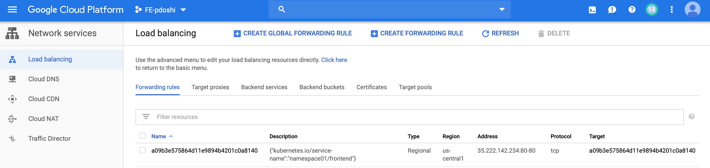
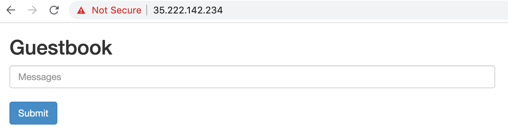

== Deploying Apps using k8s Services, Creating Nginx Ingress Controller

Now that we can deploy a sample app, let's deploy an app that is accessible in two different ways: as a Service type 'Loadbalancer' and as a Service type 'Ingress' with an nginx ingress controller that will route the request for the app.

Navigate to 'guestbook' folder and run the following command:

----
kubectl create -f guestbook-all-in-one.yaml -n namespace01

service "redis-master" created
deployment "redis-master" created
service "redis-slave" created
deployment "redis-slave" created
service "frontend" created
deployment "frontend" created
----

Run the below command to see the different services that are created for these apps:

----
kubectl get services -n namespace01

NAME           TYPE           CLUSTER-IP       EXTERNAL-IP      PORT(S)        AGE
frontend       LoadBalancer   10.100.200.185   35.222.142.234   80:31002/TCP   1m
node-js        NodePort       10.100.200.41    <none>           80:31070/TCP   12m
redis-master   ClusterIP      10.100.200.81    <none>           6379/TCP       1m
redis-slave    ClusterIP      10.100.200.154   <none>           6379/TCP       1m
----

You will see in the output that an external-ip is assigned to the frontend services (which is of type 'LoadBalancer'). How did this happen? The answer is in the file 'guestbook-all-in-one.yaml', frontend 'service' section.

----
apiVersion: v1
kind: Service
metadata:
  name: frontend
  labels:
    app: guestbook
    tier: frontend
spec:
  # if your cluster supports it, uncomment the following to automatically create
  # an external load-balanced IP for the frontend service.
  type: LoadBalancer
  ports:
  - port: 80
  selector:
    app: guestbook
    tier: frontend
----

When a service of type 'LoadBalancer' is created in public cloud environment, it will create a loadbalancer with a public IP and the frontend app is accessed through that IP. 

If you look in the GCP load balancer view, you will see that a load balancer is created for this service.

Accessing the app using that public IP will display the guestbook frontend application.

 

